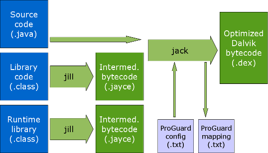

# Jack & Jill

dagezi@{twitter, github, gmail.com}
takeshi.sasaki@quipper.com


## 自己紹介

- Quipper で Androidやってます
- 東南アジア貧弱環境むけアプリ作ってます
- Resistance Agent


## APKができるまで


(from [saikoa](https://www.saikoa.com/blog/the_upcoming_jack_and_jill_compilers_in_android))


# 面倒くさい!


## Jackと Jillで



(from [saikoa](https://www.saikoa.com/blog/the_upcoming_jack_and_jill_compilers_in_android))


# 簡単!


## 使い方

```
android {
    ...
    buildToolsRevision ‘21.1.2’
    defaultConfig {
      // Enable the experimental Jack build tools.
      useJack = true
    }
    ...
}
```

- progurad.txt とかも互換性あり
- multidexもおk
- annotationはだめ


## なんで?
- コンパイルが遅いから?
- Oracleとの裁判のせい?
 - でも API変わんないから直接意味は無い
- 独自の言語拡張のため?


## Java8?

- サポートしてません!
- 難しさは変わらないのでは?
 - 問題は JavaVM ABIにある (他のライブラリとの互換性)
 - invokedynamic がほぼ必要


# Googleの考えることは謎


## 中身

https://android.googlesource.com/toolchain/jack/

- ECJ (eclipseの Java compiler)
- dx
- proguard相当は再実装してるみたい


## ベンチマーク

Templateの HelloWorldアプリをコンパイル

通常:

```
Total time: 16.577 secs
```

Jack&Jill:

```
Total time: 40.62 secs
```


## 将来に期待

- 正直、今、ご利益はない
- Google何企んでるの?
